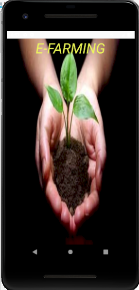

# Efarming-Android-Project

<h1>App Name: E-Farming</h1>
<h2>App Logo<h2>

<h2>Team Members:</h2>
 <li>1.Nikitha Kethireddy</li>
 <li>2. Philip</li>
 <li>3. Yugandhar Mamidi</li>

<h2> Introduction to our Project:</h2>

The main purpose of our project is to provide the assistance to the farmers who are new to the Agricultural cultivation process.Our app E-Farming helps the begginers who are interested to start working in the field of agriculture.

 Our project helps the users to get the information regarding the crops and also helps in providing the information regarding the crops grown in particular temperatures and what are the herbicides used for the crops and how much quantity of crop requires what resources and those kind of information

 Our project also helps the users to access their current location and also helps them to find the nearest markets to them where the crop can be selled. Our project also provides suggestions to the users to find the crop prices in the markets

<h2>Specifications/Support Version:</h2>

We are using android API version of 9.0-API 28 in GENY MOTION. The size of the layout is 1440x2960 with a density of 560. 
The complete details of the device we have used in our project is:
Device Name: Google Pixel 2 XL
Android API: 9.0 API 28
Size: 1440*2960 in Genymotion

Database: Firebase.com (Cloud database)

<h2>Installation Steps</h2>
<ul>
Installation of this app is much more easier with just few steps
The User can download the apk file of the EFarming App.
By clicking on the apk file, It install's the app in your android mobile.
Once the App gets installed the user can click on the App icon to open it.
Later on, the user can register into the app and can find the informations regarding the farming.
</ul>

<h2>Requirements:</h2>

<ul>
Mobile with the Android operating System.
We need the above API properties to run the app and to have good user interface.
Minimum 1 GB RAM.
Minimum 8 GB internal storage
To run this app we need internet.
</ul>

<h2>Sources used for our Project:</h2>

https://stackoverflow.com/questions/15748558/android-developer-documentation-download  
https://www.youtube.com/watch?v=tLVz5wmNyrw 
https://www.youtube.com/watch?v=on_OrrX7Nw4 
https://www.youtube.com/watch?v=urLA8z6-l3k&list=PLgCYzUzKIBE-vInwQhGSdnbyJ62nixHCt&index=2

<h2>Test Credentials:</h2>

<ul>
 Username: efarming2020@gmail.com  
 password: efarm@2020
 </ul>

<h2>Layouts of our project:</h2>

This is a Splash screen page of the app which is displayed immediately when the app is started

